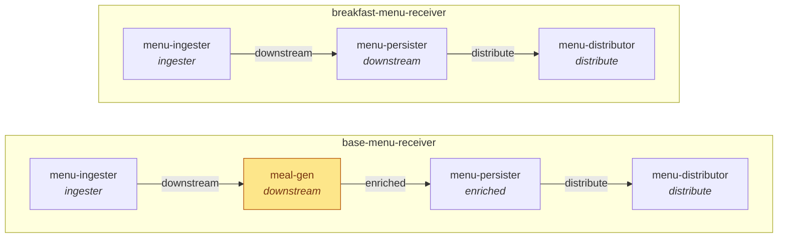

# Component aliasing: one set of components, two pipelines

This example checks Cosmonic's answer to TwoSix-WIT-Dependency-Pain-Points. **The Workload, not the component, decides which component fills a wRPC import.**

It builds the franchised-restaurant scenario from that document. Four generic components are deployed as two Workloads. One Workload injects `meal-gen` between the ingester and the persister; the other leaves it out. No component is rebuilt, forked or stubbed.



*Edge labels are import labels. The italic text is each component's `name` in the Workload.*

## How it works

This uses wasmCloud 2.10 / Cosmonic Control 0.12.2, [wasmCloud#5593](https://github.com/wasmCloud/wasmCloud/pull/5593).

1. **One role interface.** `wit/tst-menu/package.wit` defines `tst:menu/stage` with a single function: `process(list<menu-item>) -> result<list<menu-item>, string>`. No component imports a peer-specific interface.
2. **Labeled imports.** An upstream stage imports `stage` under a role label, and the label compiles to an `(implements ..)` import:

   | Component | World |
   |---|---|
   | menu-ingester | `import downstream: tst:menu/stage@0.1.0;` |
   | meal-gen | `import enriched: tst:menu/stage@0.1.0;` and `export tst:menu/stage@0.1.0;` |
   | menu-persister | `import distribute: tst:menu/stage@0.1.0;` and `export tst:menu/stage@0.1.0;` |
   | menu-distributor | `export tst:menu/stage@0.1.0;` |

   `wasm-tools component wit components/meal-gen/meal-gen.wasm` shows both the labeled import and the plain export.
3. **The Workload binds labels to components by `name`.** A component's `name` in the manifest is the label it serves. In `manifests/base-menu-receiver.yaml` the persister is named `enriched`; in `manifests/breakfast-menu-receiver.yaml` the same artifact is named `downstream`. The base Workload has two exporters of `tst:menu/stage`: meal-gen and the persister. That is pain point 6, and the labels settle it.

In Go, each label becomes its own bindings package, so a call is simply `downstream.Process(items)`. `downstream` is `components/menu-ingester/downstream/`, generated from the label.

Pain points from the original document that this addresses:
- **#1:** topology is set at build time.
- **#2:** imports name peers instead of roles.
- **#4:** components have to be forked for each topology.
- **#6:** an interface can only have one provider per Workload.

Pain point **#3**, optional imports, is not addressed. Every label still has to be filled; the breakfast Workload simply fills `downstream` with the persister.

## Layout

```
wit/tst-menu/package.wit     single source of tst:menu; `make sync-wit` copies it into each component
components/<name>/           componentize-go.toml, wit/world.wit, hand-written Go, generated bindings
manifests/                   the two HTTPTriggers
scripts/upgrade-control.sh   in-place 0.10.0 -> 0.12.2 upgrade (CRDs + control + hostgroups)
scripts/test.sh              end-to-end assertions
```

The hand-written code is small:
- `components/menu-ingester/handler.go`
- `components/*/export_tst_menu_stage/stage.go`

Everything else under `components/` is generated by `make bindings`, including `go.mod`: componentize-go always writes its own, with module `wit_component`.

## Prerequisites

- **Go 1.27.1 or later.** The Makefile sets `GOTOOLCHAIN=go1.27.1`, so any installed Go downloads it automatically.
- **componentize-go v0.4.3.** `make tools` installs it into `.bin/`. v0.4.3 is the first release whose wit-bindgen emits `(implements ..)` imports.
- **wash 2.7 or later**, for `oci push --ca-path`.
- **Cosmonic Control 0.12.2 or later**, whose host runs wasmCloud runtime 2.10.0. `scripts/upgrade-control.sh` upgrades an existing install in place.
- **`/etc/hosts` entry:** `127.0.0.1 registry.localhost.cosmonic.sh`, needed for pushing through the Traefik SNI route. The test script uses `curl --resolve`, so the workload hosts don't need entries.

## Build, push, deploy, test

```bash
make build     # tools + sync-wit + bindings + build all four components
make push      # wash oci push to registry.localhost.cosmonic.sh/library/*:0.1.0
make deploy    # kubectl apply -f manifests/
make test
```

Test output against the kind cluster (Control 0.12.2, 2026-09-29):

```
PASS base-menu: trace=["menu-ingester","meal-gen","menu-persister","menu-distributor"] described=true
PASS breakfast-menu: trace=["menu-ingester","menu-persister","menu-distributor"] described=false
PASS POST keeps description
Workload wiring (component name -> image@digest):
  base-menu-receiver-85c69f9d78
    ingester    menu-ingester:0.1.0@sha256:7a6704439ec3
    downstream  meal-gen:0.1.0@sha256:467625733df8
    enriched    menu-persister:0.1.0@sha256:0815fa0e33c4
    distribute  menu-distributor:0.1.0@sha256:75a999220bec
  breakfast-menu-receiver-5688bc8fdd
    ingester    menu-ingester:0.1.0@sha256:7a6704439ec3
    downstream  menu-persister:0.1.0@sha256:0815fa0e33c4
    distribute  menu-distributor:0.1.0@sha256:75a999220bec
```

The same `menu-persister` digest serves as `enriched` in one Workload and as `downstream` in the other.

Try it by hand:

```bash
curl --resolve base-menu.localhost.cosmonic.sh:80:127.0.0.1 http://base-menu.localhost.cosmonic.sh/
curl --resolve breakfast-menu.localhost.cosmonic.sh:80:127.0.0.1 -X POST \
  -d '[{"name":"waffles","meal":"breakfast","description":null,"ingredients":[],"trace":[]}]' \
  http://breakfast-menu.localhost.cosmonic.sh/
```

## Gotchas found along the way

- **The ingester is WASI P2, not P3.** `go.bytecodealliance.org/pkg` v0.3.0's P3 `wasihttp` adapter doesn't compile against its own committed bindings. The adapter uses `types.MethodGet` and similar constants, but the bindings (wit-bindgen 0.62.0) only generate `MakeMethodGet()`. P2 builds with stock Go 1.27.1 and needs no patched toolchain. The labeled import itself is unaffected, and nothing here needs async.
- **Don't `go run` componentize-go** if you use P3. `go run` exports `GOROOT` to the child process. The patched async-capable Go that componentize-go downloads then reports the stock GOROOT and fails its `wasiOnIdle` check with "downloaded Go does not support async". The Makefile installs the wrapper into `.bin/` instead.
- **A stale patched-Go cache is silently reused.** componentize-go caches its patched Go at `~/Library/Caches/componentize-go/v2/go-darwin-arm64-bootstrap` and never re-checks the version. The go1.25.5 bootstrap left there by the h3 build (componentize-go 0.4.2-pre) blocked v0.4.3's go1.27.1 download. Delete or rename that directory when upgrading.
- **The component's world must not also include `wasi:http`.** Declare only the labeled import in the ingester's own world. Pull in the HTTP entrypoint by listing `bytecodealliance:pkg/wasip2@0.1.0` as a second world in `componentize-go.toml`, so pkg's pre-generated export glue is used.
- **wash ignores `SSL_CERT_FILE`.** Pass the in-cluster CA with `wash oci push --ca-path` (or `WASH_OCI_CA_PATHS`). The CA is `ca.crt` in the `registry-tls` secret.
- **The upgrade from 0.10.0 to 0.12.2** was additive for our values: new `terminationGracePeriodSeconds`, `operator.xds.*`, `nexus.tls` and `dataNats.tls` keys. The hostgroup `wasip3: true` value we had set isn't a key in either chart version, so it's ignored. The h3 HTTPTriggers stayed Ready and served 200 through the upgrade.

## Local development with `wash dev`

Not exercised here; the local wash is 2.7 and this needs wash 2.10. Per Cosmonic, the same `name` aliasing works in `.wash/config.yaml`:

```yaml
dev:
  components:
    - name: downstream   # meal-gen fills the ingester's `downstream` role
      file: ../meal-gen/meal-gen.wasm
    - name: enriched     # the persister fills meal-gen's `enriched` role
      file: ../menu-persister/menu-persister.wasm
    - name: distribute   # the distributor fills the persister's `distribute` role
      file: ../menu-distributor/menu-distributor.wasm
```
